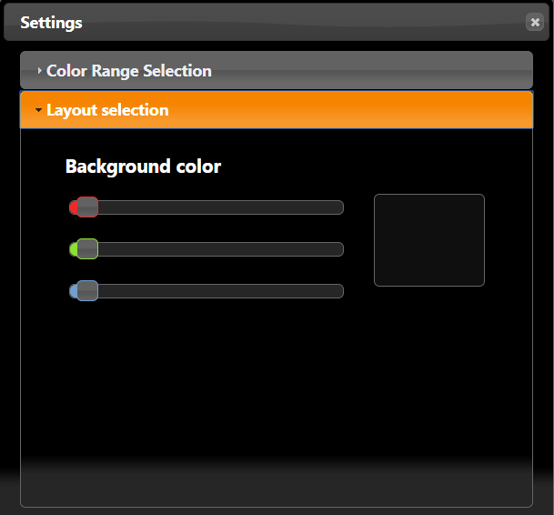
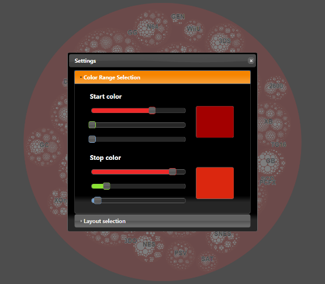

For the course ‘Data visualization’ on my college I have 5 assignments against
the end of the 1st semester.

Each of these assignments are for letting us learn to know to how to visualize
this data in a creative, but also accessible and informative way.

Below I will give a short explanation about the task, the short line above each
assignment, is just a short note for me, as well as for the teacher to let him
know what the properties of my assignment are.

1st assignement:

A.1 exploratory \|\| A.2 Interactive \|\| A.x 3D

A visual representation about the the the top selling video games for each game
console, with a subdivision based on their platform and their publisher. There
are also some options for changing the background as well as the stack colors.

