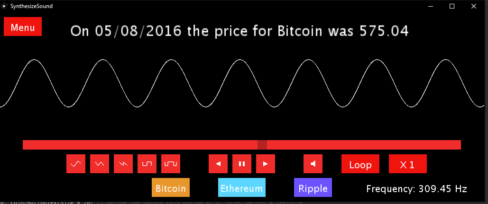
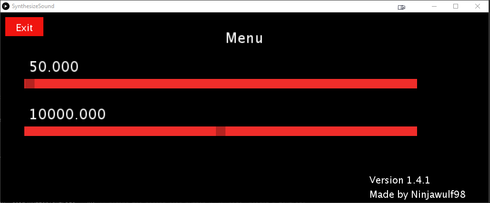
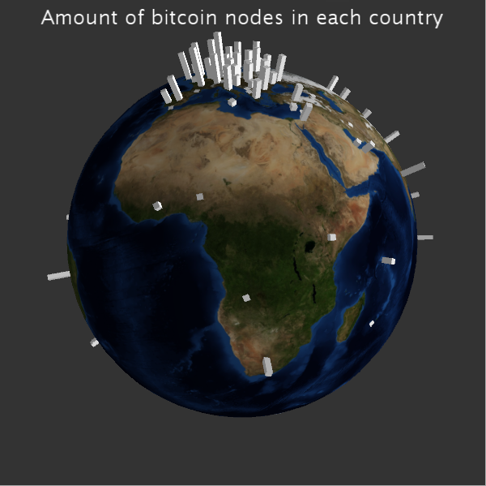
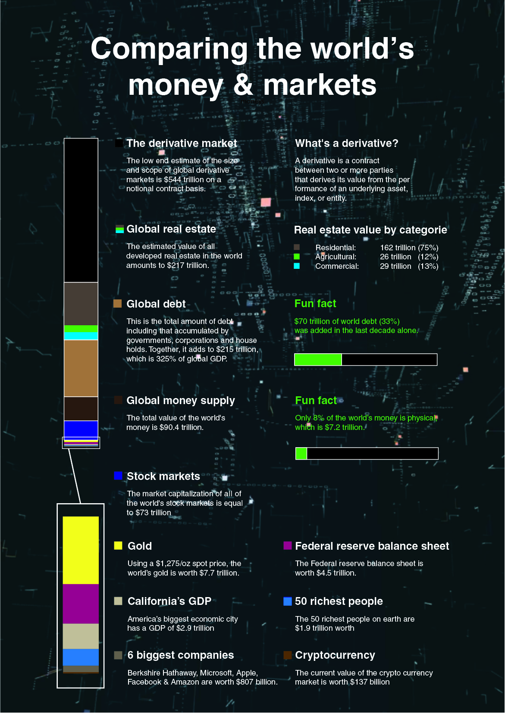

For the course ‘Data visualization’ on my college I have 5 assignments against
the end of the 1st semester.

Each of these assignments are for letting us learn to know to how to visualize
this data in a creative, but also accessible and informative way.

Below I will give a short explanation about the task, the short line above each
assignment, is just a short note for me, as well as for the teacher to let him
know what the properties of my assignment are.

1st assignment:

A.1 exploratory \|\| A.2 Interactive \|\| A.x D3

A visual representation about the top selling video games for each game console,
with a subdivision based on their platform and their publisher. There are also
some options for changing the background as well as the stack colors and to
display less data because there could be performance issues with this
visualization.

2nd assignment:

A.1 exploratory \|\| B Auditive \|\| A.2 Interactive

A simple audiovisual representation for the price movement for Bitcoin, Ethereum
and Ripple, the frequency from the waves are determined by the price in relation
with it’s min and max price through the entire price history. It’s possible to
set different wave patterns, pause the music, play forward & backward, loop,
mute & change the speed by which they are playing.

3th assignment

A.1 exploratory \|\| A.2 Linear \|\| A.x Node-based

A linear visualization from the price movement of Bitcoin, Ethereum and Ripple,
with it’s maximum & minimum price throughout it’s history (based on the data!!!)
and the return of investment if you bought each of them at the lowest possible
value.

4th assignment

A.1 exploratory \|\| A.2 Linear \|\| A.x 3D

A logarithmic 3D visualization from the amount of Bitcoin nodes in each country.
Those are projected on a constantly rotating sphere in the form of a beam, the
length of the beam represents the logarithmic value from the amount of nodes in
that country.

5th assignment

A.1 explanatory \|\| A.2 Static \|\| /

A visualization and short comparison of the different kinds of money that exists
in the world.

